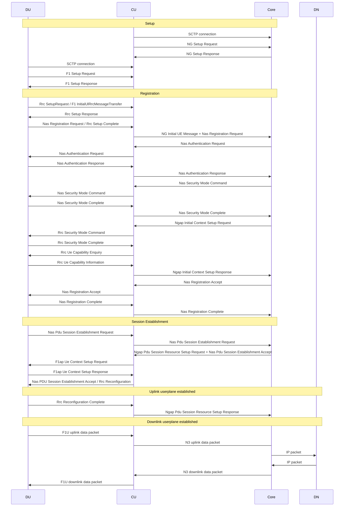

# Mainline attach flow
This is the mainline flow wherein a 5G UE connects to the RAN and 5G Core and sets up a PDU session.

Depending on its mode, QCore plays the role of the Core+CU columns, or just the Core column.  

The following are assumed: 
- Rrc DlInformationTransfer / F1ap DlRrcMessageTransfer / Ngap Downlink NAS transport
- Rrc UlInformationTransfer / F1ap UlRrcMessageTransfer / Ngap Uplink NAS transport

