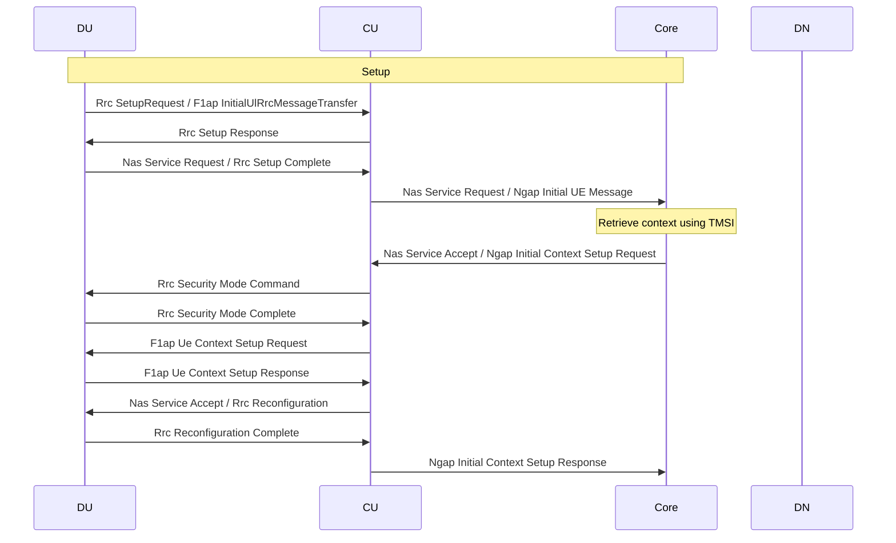

# Service request flow

```mermaid
sequenceDiagram
  participant DU
  participant CU
  participant Core
  participant DN
  Note over DU,Core: Setup
  DU->>CU: Rrc SetupRequest / F1ap InitialUlRrcMessageTransfer 
  CU->>DU: Rrc Setup Response 
  DU->>CU: Nas Service Request / Rrc Setup Complete 
  CU->>Core: Nas Service Request / Ngap Initial UE Message 
  Note over Core: Retrieve context using TMSI
  Core->>CU: Nas Service Accept / Ngap Initial Context Setup Request
  CU->>DU: Rrc Security Mode Command 
  DU->>CU: Rrc Security Mode Complete
  CU->>DU: F1ap Ue Context Setup Request
  DU->>CU: F1ap Ue Context Setup Response
  CU->>DU: Nas Service Accept / Rrc Reconfiguration 
  DU->>CU: Rrc Reconfiguration Complete 
  CU->>Core: Ngap Initial Context Setup Response 
```